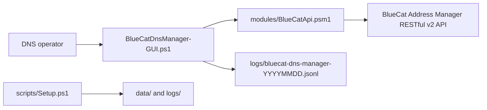

# BlueCat DNS Manager Codebase Guide

This directory is the collaboration hub for the BlueCat DNS Manager GUI and API module. It documents the current implementation, ownership boundaries, operational behavior, known risks, and the expected workflow for future changes.

Last reviewed: June 11, 2026

## Current Status

The application is a Windows PowerShell 5.1 WPF client for the BlueCat Address Manager (BAM) RESTful v2 API. Its supported workflow is:

1. Connect to BAM and select a configuration and DNS view.
2. Load zones recursively.
3. Search, create, modify, or delete DNS resource records.
4. Optionally deploy a create or modify with selective deployment.
5. Optionally deploy a deletion with zone quick deployment.
6. Review deployment-service events, deployment task fallback data, and local JSONL activity logs.

There is no local staging database or scheduled deployment worker. The schedule controls remain visible but disabled so the removal is explicit to operators.

## Repository Map

```text
BlueCatDNS/
|-- BlueCatDnsManager-GUI.ps1          WPF UI, validation, workflows, and logs
|-- modules/
|   `-- BlueCatApi.psm1                BAM RESTful v2 API wrapper
|-- scripts/
|   `-- Setup.ps1                      Creates runtime data and log folders
|-- docs/
|   `-- bluecat-dns-manager/
|       `-- README.md                  This codebase and collaboration guide
|-- Launch-BlueCatDnsManager.bat       Standard launcher
|-- Launch-BlueCatDnsManager-SkipCert.bat
|-- HOWTO.md                           Operator-focused usage guide
`-- README.md                          Project overview and quick start
```

The `data/` and `logs/` directories are runtime artifacts and may not exist before setup or first launch.

## Architecture



### Ownership Boundary

`BlueCatDnsManager-GUI.ps1` owns:

- XAML and WPF controls
- User input validation and confirmation dialogs
- Configuration, view, and zone selection state
- Record and deployment display models
- Workflow orchestration across API calls
- Local activity/error logging

`modules/BlueCatApi.psm1` owns:

- BAM authentication and logout
- Session headers and selected configuration/view context
- REST URI construction and request execution
- BlueCat record payload construction
- BlueCat-specific headers
- Response collection normalization
- Deployment and server API functions

Keep direct `Invoke-RestMethod` calls inside the API module. The GUI should call exported module functions so authentication, error handling, and payload rules stay centralized.

## Runtime Flow

### Startup

1. The GUI loads WPF assemblies.
2. It resolves the repository root and creates `data/` and `logs/` if needed.
3. It imports `modules/BlueCatApi.psm1`.
4. It parses the embedded XAML and maps named controls.
5. It initializes the record form, deployment grid, and current daily log file.

If XAML parsing fails, details are written to `logs/xaml-parse-error.txt`.

### Connection and Context

1. `Connect-BlueCat` posts credentials to `/api/v2/sessions`.
2. The API module stores returned session credentials in module-scoped memory.
3. The GUI loads configurations, then views for the selected configuration.
4. `Set-BlueCatContext` records the active configuration and view IDs.
5. The GUI recursively loads top-level zones and child zones into a cache.

Credentials and session credentials must never be written to application logs.

### Record Search

The GUI builds one of two filters:

- A short name searches the `name` field.
- A dotted/FQDN-like value searches the `absoluteName` field.

`Get-BlueCatResourceRecords` currently requests at most 100 records. Pagination is not implemented.

Host record IP values might not be present on the zone record collection response. When the collection row does not include an address, the GUI follows the record's address subcollection through `GET /api/v2/resourceRecords/{id}/addresses`.

### Create and Modify

Create and modify operations accept these GUI record types:

| GUI type | API type | Value format |
|---|---|---|
| A / Host Record | `HostRecord` | IPv4 address |
| CNAME | `AliasRecord` | Existing target FQDN; create requires selecting the target record |
| MX | `MXRecord` | `priority target` |
| TXT | `TXTRecord` | Text value |
| SRV | `SRVRecord` | `priority weight port target` |
| Generic | `GenericRecord` | Raw RDATA |

The Task ID or comment is sent in the `x-bcn-change-control-comment` header. Host record creation can also send `x-bcn-create-reverse-record: true`.

Modify uses `PUT`, so `Update-BlueCatResourceRecord` first reloads the existing record and reconstructs the required payload rather than sending only changed fields.

### Delete

Delete requires an explicit confirmation. The record is removed with `DELETE /api/v2/resourceRecords/{id}`.

If immediate deployment is selected, the GUI uses zone quick deploy because the deleted entity can no longer be fetched for selective deployment.

## Deployment Behavior

| GUI action | API operation | Scope |
|---|---|---|
| Deploy after create | Selective deployment | Created record entity |
| Deploy after modify | Selective deployment | Modified record entity |
| Deploy after delete | Zone quick deployment | All pending changes in the selected zone |
| Selective Deploy tool | Selective deployment | Entered record entity ID |
| Quick Deploy tool | Zone quick deployment | All pending changes in the selected zone |
| Recent Server Deployments | Server deployment collection | Newest 50 selective, differential, and full deployment records for the selected server |
| Check ID | Event lookup first, deployment lookup fallback | One event or deployment ID |

Quick deploy is broader than the selected record. The confirmation text must continue to warn that it can push all pending changes in the selected zone.

The GUI displays deployment responses and deployment-service events. It does not currently expose server deployment, even though `Invoke-BlueCatServerDeploy` is available in the API module.

## API Module Reference

### Session and Context

| Function | Purpose | GUI use |
|---|---|---|
| `Connect-BlueCat` | Creates a BAM API session and initializes headers | Yes |
| `Disconnect-BlueCat` | Logs out the current session and clears headers | Yes |
| `Get-BlueCatCurrentUser` | Returns the in-memory BAM username | Yes |
| `Set-BlueCatContext` | Stores active configuration and view IDs | Yes |
| `Get-BlueCatConfigId` | Returns the stored configuration ID | Module/console |
| `Get-BlueCatViewId` | Returns the stored view ID | Module/console |
| `Test-BlueCatConnection` | Tests the current session endpoint | Module/console |

### Configuration, View, Zone, and Server Lookup

| Function | Endpoint or behavior | GUI use |
|---|---|---|
| `Get-BlueCatConfigurations` | `GET configurations` | Yes |
| `Get-BlueCatViews` | `GET configurations/{id}/views` | Yes |
| `Get-BlueCatZones` | `GET views/{id}/zones` | Yes |
| `Find-BlueCatZone` | Finds a zone by exact absolute name | Module/console |
| `Get-BlueCatSubZones` | `GET zones/{id}/zones` | Yes |
| `Get-BlueCatServers` | `GET configurations/{id}/servers` | Module/console |

### Resource Records

| Function | Purpose | GUI use |
|---|---|---|
| `Get-BlueCatResourceRecords` | Lists/filter records in a zone | Yes |
| `Get-BlueCatResourceRecord` | Loads one record by ID | Indirectly |
| `Get-BlueCatResourceRecordAddresses` | Loads address resources linked to a host record | Yes |
| `New-BlueCatResourceRecord` | Builds a type-specific create payload | Yes |
| `Update-BlueCatResourceRecord` | Reloads and replaces a record with `PUT` | Yes |
| `Remove-BlueCatResourceRecord` | Deletes a record with optional change comment | Yes |
| `Get-BlueCatRecordTypeDisplayName` | Converts API type names for display | Yes |
| `Get-BlueCatRecordTypeApiName` | Converts GUI type names for API calls | Yes |

### Deployments

| Function | Purpose | GUI use |
|---|---|---|
| `Invoke-BlueCatSelectiveDeploy` | Deploys one resource with `specific` or `related` scope | Yes |
| `Invoke-BlueCatQuickDeploy` | Starts a zone quick deployment | Yes |
| `Invoke-BlueCatServerDeploy` | Starts a DNS/DHCP/DHCPv6/TFTP server deployment | Module/console |
| `Get-BlueCatDeploymentStatus` | Loads one deployment by ID | Yes |
| `Get-BlueCatEvent` | Loads one BAM event-list entry by ID when available | Yes |
| `Get-BlueCatEvents` | Loads recent BAM event-list entries when available | Module/console |
| `Get-BlueCatDeploymentEvents` | Filters recent event-list entries to deployment-service events | Module/console |
| `Get-BlueCatDeployments` | Lists recent/filterable global deployments | Module/console |
| `Get-BlueCatServerDeployments` | Lists deployment history for one server | Yes |

### Internal Helpers

`Invoke-BlueCatApi` is the central HTTP boundary. It merges session and operation headers, serializes objects to JSON with depth 10, and includes REST response details in thrown errors.

`Get-BlueCatResponseData` normalizes collection responses so callers can handle both HAL-style `{ data: [...] }` responses and direct objects.

These helpers are intentionally not exported.

## GUI Code Map

The GUI is currently one script containing both XAML and event code. Its major regions are:

| Region | Responsibility |
|---|---|
| Bootstrap | Loads WPF assemblies, paths, and the API module |
| XAML UI Definition | Defines connection bar and four tabs |
| Control Mapping | Resolves XAML names into PowerShell variables |
| State | Tracks connection, zone cache, log file, and selection suppression |
| Logging | Writes JSONL and refreshes the Logs grid |
| Zone Helpers | Loads zones recursively and resolves selected zone IDs |
| Record Helpers | Filters, formats record data, and fills/reset forms |
| Deployment Helpers | Normalizes response objects for the deployment grid |
| Events | Connect, context selection, CRUD, logs, and deployment actions |
| Cleanup | Logs out when the WPF window closes |

The four tabs are `Create / Modify`, `Delete Record`, `Logs`, and `Deploy Tools`.

## Logging Contract

Each GUI action is written as one compressed JSON object per line:

```json
{"timestamp":"2026-06-11T10:30:00.0000000-04:00","level":"SUCCESS","action":"CreateRecord","message":"Created HostRecord 'host1' in example.com","user":"operator","details":{"EntityId":123,"TaskId":"CHG0001"}}
```

File pattern:

```text
logs/bluecat-dns-manager-YYYYMMDD.jsonl
```

The Logs tab is a local activity view. It is not an authoritative BAM staging queue and clearing the view does not delete the log file or change BAM state.

## Evaluation Snapshot

### Strengths

- API traffic is centralized in one module.
- The GUI gives explicit confirmation for destructive and broad deployment actions.
- Change-control comments are carried into BAM requests.
- API error bodies are preserved for troubleshooting.
- JSONL logging has no native database dependency.
- Create/modify deployment failures are separated from successful record changes in operator messaging.

### Maintenance Risks

- The GUI combines nearly 2,000 lines of XAML, helpers, and event handlers, which increases merge-conflict and regression risk.
- There are no automated tests or CI checks in this repository.
- Collection pagination is not implemented; record search is capped at 100 results.
- TTL, MX, and SRV inputs rely on runtime casts and need stronger preflight validation.
- Recursive zone loading can generate many sequential API calls in a large DNS hierarchy.
- API state is module-scoped and supports one active BAM session/context per PowerShell process.
- `SkipCertCheck` changes certificate validation for the process and should be limited to controlled environments.
- Quick deploy can include changes made by other activity within the selected zone.

These are documented constraints, not blockers for the current operating model. Changes that affect deployment scope, authentication, or record payloads should receive the highest review attention.

## Collaboration Rules

1. Put BlueCat HTTP behavior and payload construction in `modules/BlueCatApi.psm1`.
2. Keep UI state, dialogs, display formatting, and action logging in `BlueCatDnsManager-GUI.ps1`.
3. Use `Invoke-BlueCatApi` for authenticated REST calls.
4. Use `Get-BlueCatResponseData` for collection endpoints.
5. Export new public API functions explicitly with `Export-ModuleMember`.
6. Preserve `x-bcn-change-control-comment` support on mutating operations.
7. Never log credentials, session credentials, or authorization headers.
8. Treat quick/server deployments as broad-impact operations and require clear confirmation.
9. Update this guide and `HOWTO.md` when user-facing behavior changes.
10. Keep unrelated repository changes out of BlueCat-focused commits.

### Adding an API Operation

1. Confirm the endpoint and request/response schema against the target BAM version.
2. Add a narrowly named advanced function to `BlueCatApi.psm1`.
3. Route the request through `Invoke-BlueCatApi`.
4. Normalize list responses with `Get-BlueCatResponseData`.
5. Export the function only if GUI or console callers need it.
6. Add GUI orchestration, validation, success logging, and failure logging.
7. Run the verification checks below and perform a BAM smoke test.

## Verification

### Static PowerShell Parse Check

```powershell
$files = @(
    '.\BlueCatDnsManager-GUI.ps1',
    '.\modules\BlueCatApi.psm1',
    '.\scripts\Setup.ps1'
)

foreach ($file in $files) {
    $tokens = $null
    $errors = $null
    [void][System.Management.Automation.Language.Parser]::ParseFile(
        (Resolve-Path $file),
        [ref]$tokens,
        [ref]$errors
    )
    if ($errors) { $errors } else { "OK: $file" }
}
```

### Module Import Check

```powershell
Import-Module .\modules\BlueCatApi.psm1 -Force
Get-Command -Module BlueCatApi | Sort-Object Name
```

### Manual BAM Smoke Test

1. Connect and verify configurations, views, and zones load.
2. Search by short name and FQDN.
3. Create a test record without deployment and confirm its JSONL entry.
4. Modify the test record and confirm its change-control comment.
5. Exercise selective deployment in an environment with deployable DNS roles.
6. Delete the test record and confirm before using zone quick deploy.
7. Load recent deployment events and check a returned event ID.
8. Close the window and verify the BAM session is logged out.

## Integrity v26 Roadmap

Pending-deployment visibility and cancellation are intentionally deferred until the BAM environment is upgraded to BlueCat Integrity v26.

At that point:

1. Review the v26 RESTful v2 OpenAPI document exposed by the target BAM instance.
2. Confirm whether BAM exposes an authoritative list of undeployed record changes, ownership/user metadata, scheduled deployment state, and cancellation operations.
3. Version-gate any new functions rather than assuming behavior from an older BAM release.
4. Add a read-only pending-deployment view before adding cancellation controls.
5. Require explicit confirmation, audit logging, and deployment ID capture for cancellation.

`Get-BlueCatDeployments` shows deployment objects that BAM has created. It must not be presented as a complete list of records currently waiting for deployment unless the v26 API explicitly guarantees that relationship.
